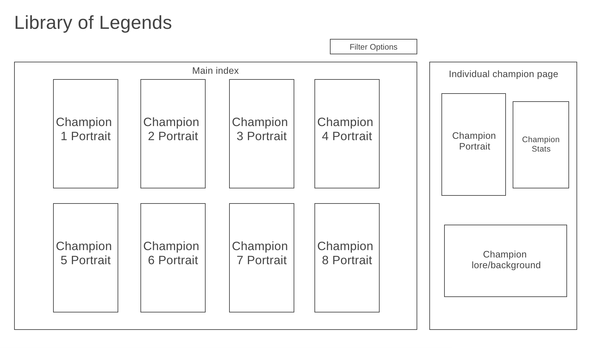

**Library of Legends**

# Background & Overview
League of Legends is an online multiplayer battle arena game in which players can choose from 157 different champions to play as. Each champion has individualized background lore and attributes. Library of Legends is an interactive library that displays all 157 champions, where the user can select a specific champion to display and view their individual profiles. 

# Functionality & MVPs
* Users start on the main index page with all champions listed
* Option to filter champions displayed by champion type
* Ability to click on a single champion and bring up their "show page"

# Wireframe
</img>

# Technologies, Libraries, & APIs
* Webpack to bundle JS code
**Static data files**
* Riot Games/Data Dragon hosted champion data: http://ddragon.leagueoflegends.com/cdn/11.20.1/data/en_US/champion.json
* Riot Games/Data Dragon hosted champion loading screen image: http://ddragon.leagueoflegends.com/cdn/img/champion/loading/Aatrox_0.jpg
* Riot Games/Data Dragon hosted individual champion data: http://ddragon.leagueoflegends.com/cdn/11.20.1/data/en_US/champion/Aatrox.json

# Implementation Timeline
* Friday/Weekend
    - Understanding how to use data from API
    - Code data retrieval from API
    - Set up webpack
    - Map out project structure
    - Create project skeleton
* Monday
    - Code basic structures of index view and individual champion view
    - Render in API data
    - Code in user interaction events
* Tuesday
    - Write out CSS and style all views
    - Reformat code as needed
* Wednesday
    - Add finishing touches
    - Quality check of both user interaction and page style
* Thursday Morning
    - Deploy to GitHub

# Bonus Features
* Background music that the user can mute
* Audio that plays when an individual champion's profile is brought up

